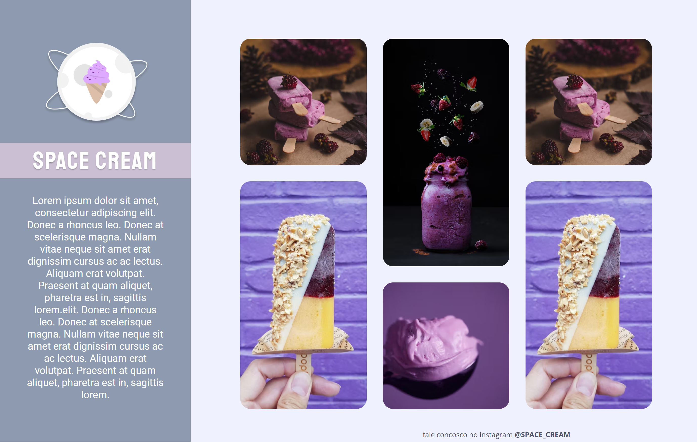

<h1>Desafio do Stage 03 - Grid com Animações </h1>

 

  

 

## 🚀 Tecnologias

Esse projeto foi desenvolvido com as seguintes tecnologias:

- HTML
- CSS
- Git
- Github
- Figma

## 💻 Projeto

Projeto prático da Trilha Explorer da Rocketseat.

- [Acesse o projeto finalizado, online](https://hugolinobg.github.io/GridComAnimacoes/)

## 🔖 Layout

Você pode visualizar o layout do projeto através [DESSE LINK](<https://www.figma.com/file/hwINN6OnhdiFCONEebsnna/Stage-03---Grid-com-anima%C3%A7%C3%B5es-(Copy)?node-id=0-3&t=7LAUppw7gooil7kc-0>). É necessário ter conta no [Figma](https://figma.com) para acessá-lo.

## Novidades

- Uso de keyframes para animação CSS

## ✉️ [Contato](https://links.hugolino.dev)

hugolino2609@gmail.com
